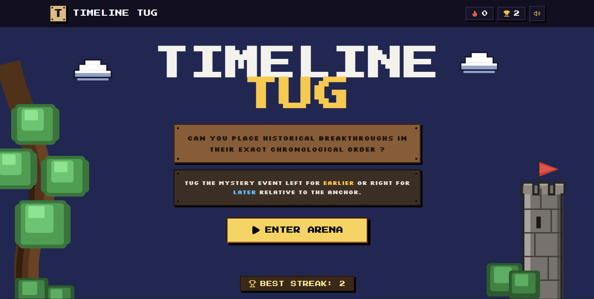
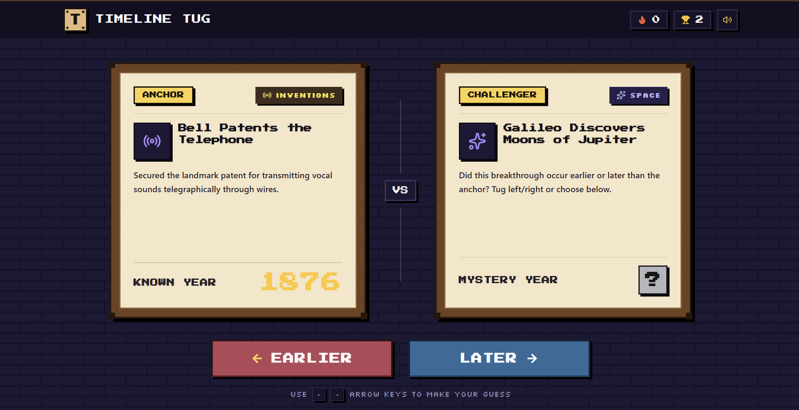

## Description

A fast-paced historical timeline guessing game where players test their chronological intuition on scientific breakthroughs, technological milestones, space exploration, and cultural inventions.

## Screenshots

 

## Features

- **Drag to guess, That's it**
  **If in Laptop then use <-- or --> arrow**

### Requirements

- Node.js 20 or later.
- npm (or pnpm / bun).

### Installation

git clone https://github.com/questcreators69-rgb/timeline_tug.git
cd timeline_tug
npm install

### To run the game

npm run dev

The application will start on `http://localhost:3000`.

## Tech stack

- **React**
- **TypeScript**
- **Tailwind CSS**
- **Lucide Icons**

## License

MIT License
