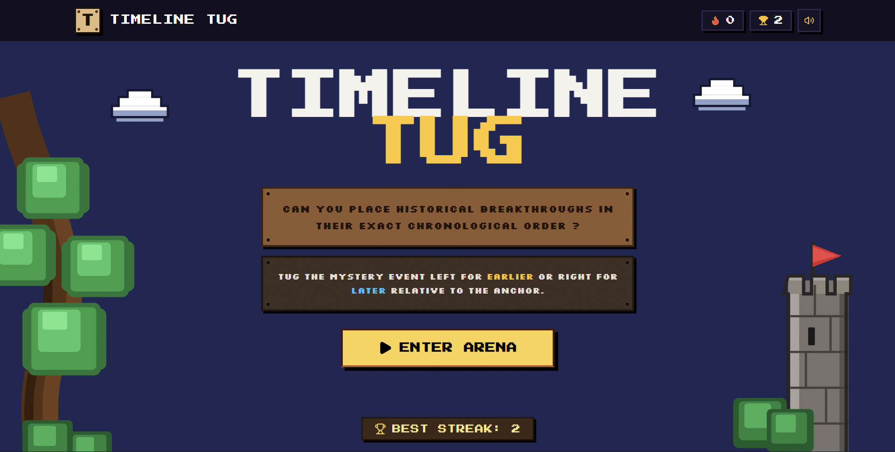
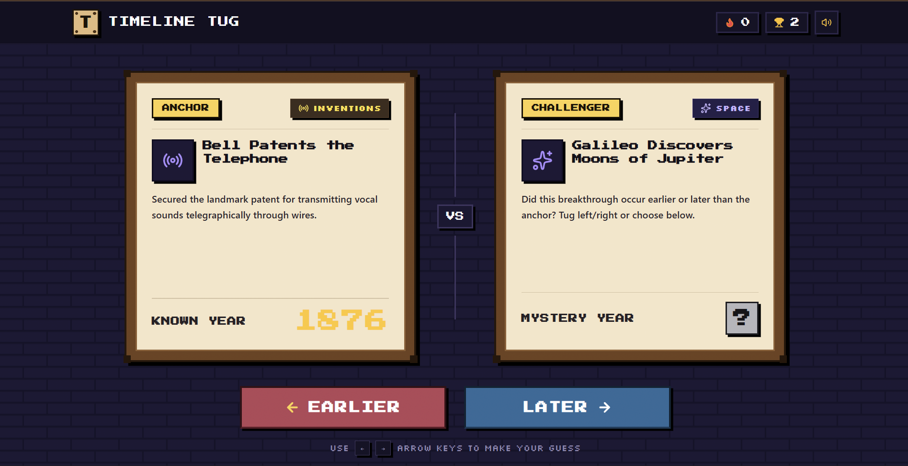

# Timeline Tug

An history trivia browser game where players guess whether historical breakthroughs happened earlier or later in time.

## Description

I created Timeline Tug because I wanted a fun, interactive way to practice historical events without forcing players to memorize exact years. I built the game as a standalone React web application using TypeScript, Vite, Tailwind CSS, and Lucide React icons. The game engine uses state-driven logic to pit mystery historical events against benchmark anchor dates, featuring custom drag-and-drop card gestures, keyboard navigation, and chiptune sound effects generated entirely with the browser's Web Audio API.

### Screenshots

 

## Getting Started

### Dependencies

- Windows 10/11, macOS, or Linux operating system
- Node.js v18.0.0 or higher
- npm (Node Package Manager)

### Installing

- Clone or download the repository code from GitHub:
  ```bash
  git clone https://github.com/questcreators69-rgb/timeline_tug.git
  ```
- Navigate into the project directory:
  ```bash
  cd timeline_tug
  ```
- Install project dependencies:
  ```bash
  npm install
  ```

### Executing program

- Step 1: Open your terminal inside the project root folder and star the local server by running :
  ```bash
  npm run dev
  ```
- Step 2: Open your browser and navigate to `http://localhost:3000`.
- Step 3: Click "ENTER ARENA" and play using touch swipes, mouse drags or the `<--' and '-->` arrow keys.

## Help

If port 3000 is already in use by another application on your system, run Vite with a custom port:

```bash
npm run dev -- --port 3001
```


## License

This project is licensed under the MIT License - see the [LICENSE.md](./LICENSE.md) file for details
```
